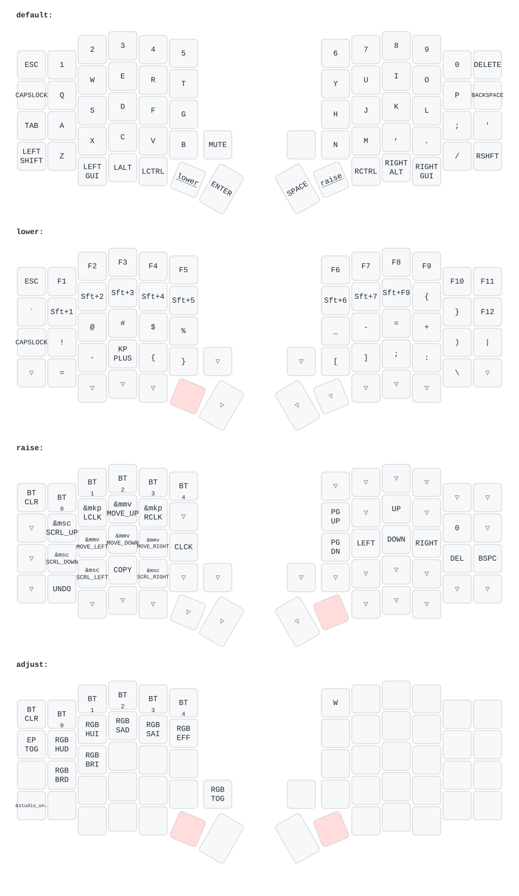

# Thông tin mở rộng: các bạn có thể copy các dòng code rồi chat với chat GPT để hiệu chỉnh code đơn giản và paste lại xong commit, sẽ có nhiều phương án tối ưu dựa trên repos có sẵn, lưu ý rằng hãy nhồi nhét chức năng đủ dùng để hoạt động mượt mà với nhu cầu, đừng tham những chức năng không cần thiết, bàn phím sẽ đơ lag nếu những chức năng đó không hiệu quả

# Edit keymap tại 
https://nickcoutsos.github.io/keymap-editor/

# Nạp lại firmware
1. Sau khi edit keymap hoặc , chờ Action chạy xong https://github.com/Huyhust13/Sofle-oled_wireless/actions, bấm vào action build mới nhất, kéo xuống dưới và tải file firmware về.
2. Giải nén file fimeware.zip vừa tải về, lần lượt cắm cáp dữ liệu type C vào 2 nửa bàn phím:
   * Nhấn đúp nhanh vào nút reset trên nửa bàn phím đó, sẽ mở ra folder **NICENANO**
   * Kéo file cấu hình của nửa đó vào folder **NICENANO**
   * Đợi 1 lúc, folder tự mất tức là đã nạp xong fw cho nửa đó.
   * Làm lần lượt với 2 nửa. 

# Dưới đây là sơ đồ cơ bản chức năng phím

